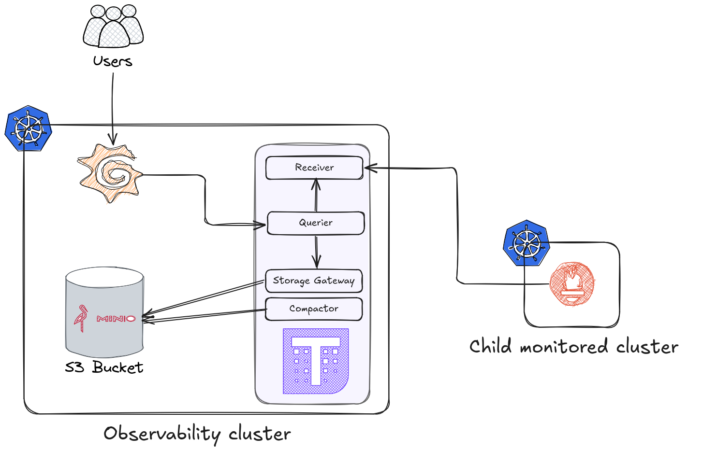

# 📊 Distributed Observability with Prometheus and Thanos (`remote_write`)

This project demonstrates how to **centralize metrics from multiple Kubernetes clusters** using Prometheus' `remote_write` feature in combination with **Thanos**, enabling scalable, long-term storage and unified querying.

## 🧠 What is `remote_write`?

`remote_write` is a Prometheus feature that allows you to **forward metrics in real-time** to an external endpoint that supports the remote write API — such as **Thanos Receiver**.

With `remote_write`, you can:
- Offload metric storage to a centralized system.
- Persist metrics in long-term object storage (e.g. S3).
- Query metrics from multiple clusters in one place.
- Reduce the burden on individual Prometheus instances.

## 🧱 Architecture overview

### 🔍 Key Components

- **Child Monitored Cluster**: runs Prometheus configured with `remote_write`, pushing metrics to the central observability system.
- **Observability Cluster**: hosts the complete Thanos stack:
  - **Receiver**: receives remote write data from external Prometheus instances.
  - **Querier**: provides a unified PromQL API to query data across all sources.
  - **Storage Gateway** and **Compactor**: handle long-term storage into an S3-compatible backend (MinIO in this case).
  - **Grafana**: visualizes all metrics across clusters.
- **S3 Bucket (MinIO)**: stores all metrics persistently and durably.

## ⚙️ Data Flow

1. Prometheus in each child cluster pushes metrics to the **Thanos Receiver** using `remote_write`.
2. The Receiver forwards the data to the **Storage Gateway**, which writes it to an **S3 bucket**.
3. The **Querier** component aggregates data from both the receiver and the S3 bucket.
4. **Grafana** queries the Querier to visualize the metrics from all clusters.

## 🚀 Benefits

- 🔁 Long-term storage of Prometheus metrics.
- 📡 Centralized observability across multiple clusters.
- 🧩 Easily extensible by adding more Prometheus instances.
- 💾 Cost-effective and scalable object storage (S3/MinIO).
- 📊 Fully compatible with Grafana and native Prometheus queries.

## 🔗 References
- [A Thanos Remote Write: Scaling Metrics with Ease- Part1](https://medium.com/@mohitverma160288/thanos-remote-write-scaling-metrics-with-ease-part1-eb861b9aefa9)
- [thanos-remote-write](https://github.com/mvtech88/thanos-remote-write)
- [Thanos (Multi Cluster Prometheus) Tutorial: Global View - Long Term Storage - Kubernetes](https://www.youtube.com/watch?v=feHSU0BMcco&t=776s)
- [Thanos (Prometheus) Tutorial: Remote Read/Write - mTLS - Step-by-Step!](https://github.com/antonputra/tutorials/tree/main/lessons/163)
- [Thanos Remote Write](https://thanos.io/v0.10/201812_thanos-remote-receive.md/)